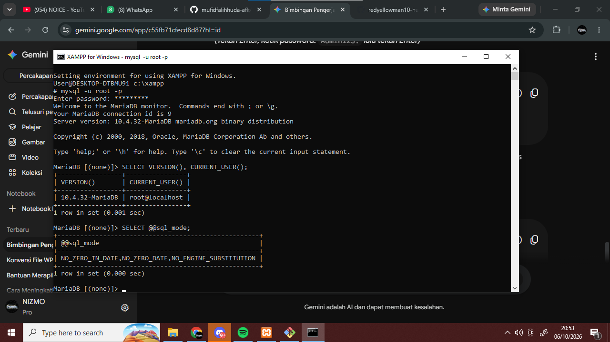
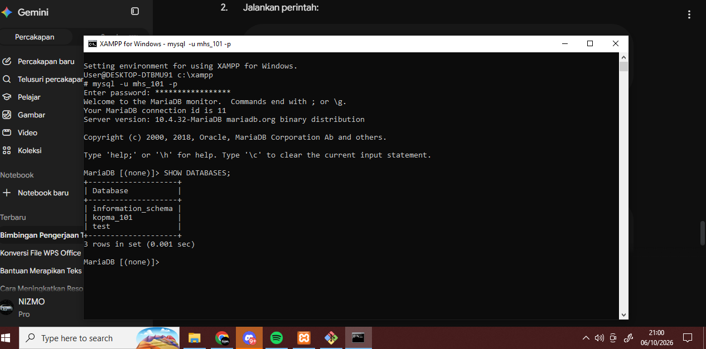
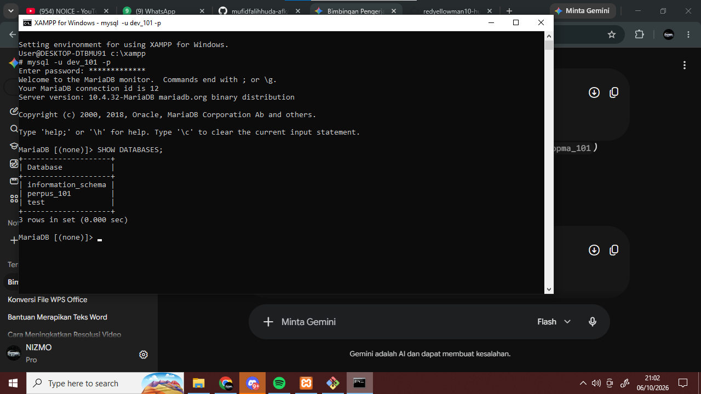
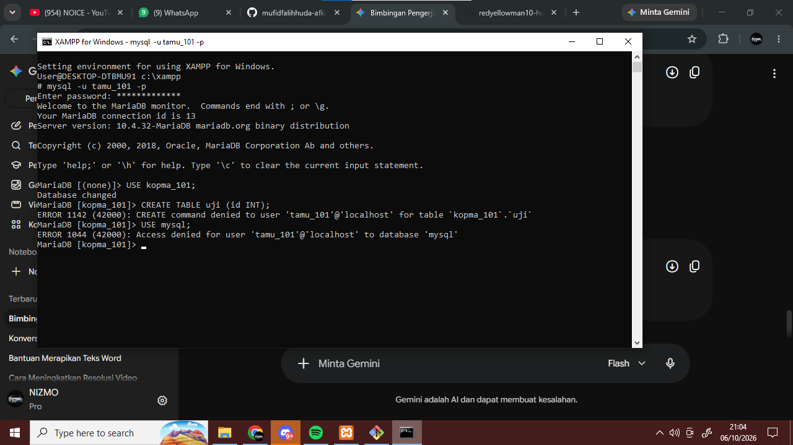
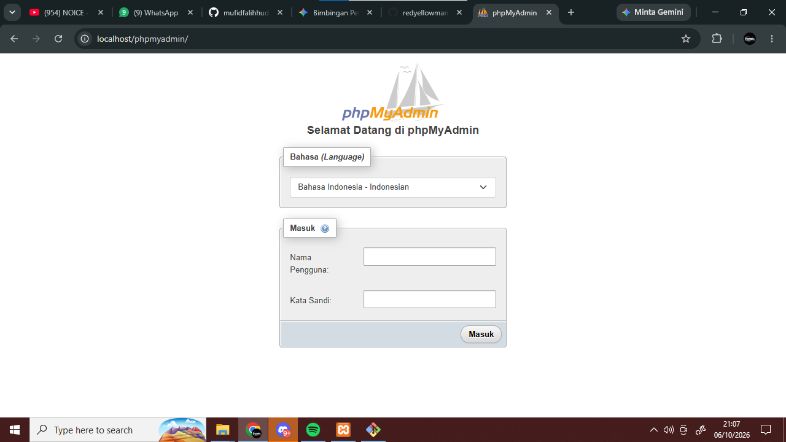
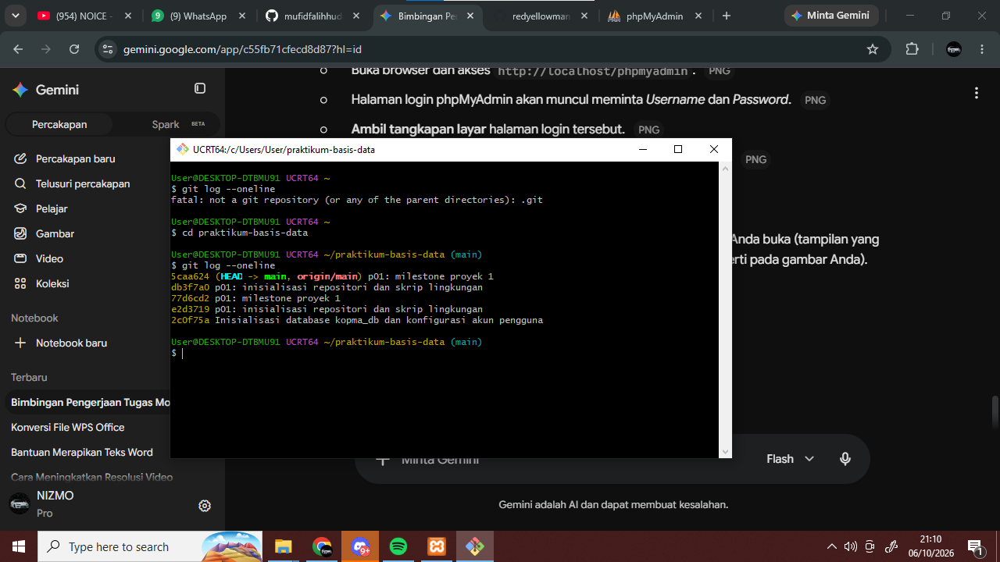

# Laporan Praktikum Basis Data - Modul 1
**Topik:** Lingkungan Kerja MariaDB, Akun, dan Git  
**NIM:** 25430101  

---

## A. Identitas Proyek Mandiri (Milestone 1)
* **Tema Proyek:** Sistem Informasi Perpustakaan
* **Nama Database:** `perpus_101`
* **Nama User Proyek:** `dev_101`
* **Organisasi Fiktif:** Perpustakaan Cendekia Mandiri
* **Deskripsi Singkat:** Pengelolaan katalog buku, peminjaman, pengembalian, serta pencatatan anggota perpustakaan secara terintegrasi.

---

## B. Jawaban Titik Analisis & Analisis Galat

### Titik Analisis 1: Label MySQL vs MariaDB
Tombol pada XAMPP berlabel MySQL karena alasan kompatibilitas historis antarmuka, tetapi DBMS yang dijalankan sebenarnya adalah MariaDB. Jika terjadi galat dasar penulisan SQL (seperti sintaks SELECT, tipe data umum), dokumentasi MySQL masih sangat relevan. Namun, ketika berhadapan dengan mesin penyimpanan bawaan (Aria), fitur otentikasi tertentu, atau sintaks modern yang menyimpang, dokumentasi resmi MariaDB wajib dirujuk.

### Titik Analisis 2: Akses Root Tanpa Opsi -p
Saat masuk menggunakan mysql -u root tanpa -p, server menampilkan pesan galat:
ERROR 1045 (28000): Access denied for user 'root'@'localhost' (using password: NO)
Bagian yang menunjukkan klien tidak mengirim kata sandi adalah klausa (using password: NO).

### Titik Analisis 3: Akses information_schema vs mysql (Kode 1044 vs 1045)
Basis data information_schema tetap terlihat oleh user mhs_101 karena merupakan basis data standar ANSI yang berisi metadata/katalog sistem yang wajib dibaca oleh semua klien yang berhasil terautentikasi. Sementara perintah USE mysql; ditolak dengan kode galat 1044 karena akun kerja tidak memiliki izin hak akses (privilege) ke tabel internal kredensial server.
* Perbedaan Galat:
  * ERROR 1045: Masalah otentikasi/identitas (user salah atau password salah/tidak dikirim).
  * ERROR 1044: Masalah otorisasi/hak akses (user valid dan login berhasil, tetapi dilarang mengakses objek basis data yang diminta).
  * ERROR 1142: Masalah hak akses pada level perintah/tabel (contoh: user memiliki izin koneksi ke database, tetapi ditolak saat menjalankan CREATE TABLE karena hanya memiliki izin SELECT).

### Titik Analisis 4: Keamanan Autentikasi cookie vs config
Mode cookie pada phpMyAdmin jauh lebih aman karena meminta pengguna memasukkan nama pengguna dan kata sandi setiap kali sesi dimulai, serta kredensial disimpan terenkripsi di sisi klien secara sementara. Mode config menyimpan kata sandi dalam bentuk teks terbuka (plain-text) di berkas config.inc.php, sehingga siapa pun yang bisa membuka berkas tersebut langsung memperoleh hak akses penuh ke basis data.

---

## C. Bukti Tangkapan Layar (Screenshots)
*(Catatan: Tangkapan layar memperlihatkan jam Windows dan nama akun terminal sesuai ketentuan)*

1. Pemeriksaan Versi Server & Akun:
   

2. Daftar Basis Data Akun Kerja mhs_101:
   

3. Daftar Basis Data Akun Proyek dev_101 (Terisolasi dari kopma_101):
   

4. Bukti Galat Hak Akses (1044 saat akses DB sistem / 1142 saat akun tamu mencoba CREATE TABLE):
   

5. Antarmuka Login phpMyAdmin Mode Cookie:
   

6. Bukti Eksekusi Git Push Pertama:
   
