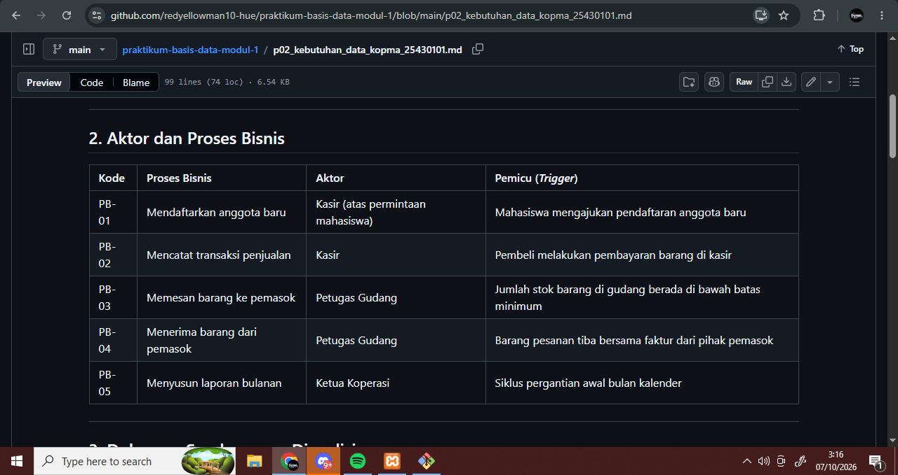
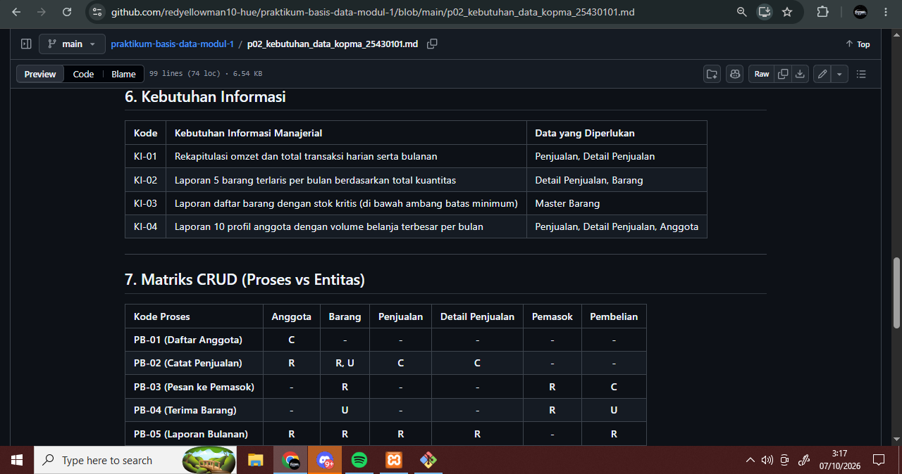
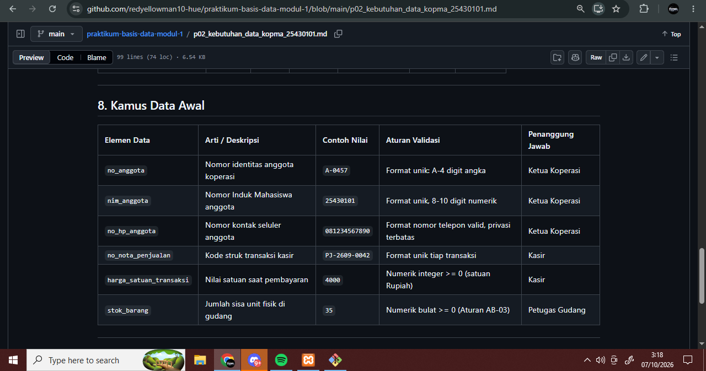

# Laporan Praktikum Basis Data - Pertemuan 02

**Nama** : Mahasiswa Basis Data  
**NPM** : 25430101  
**Kelas** : D  
**Tanggal** : 07 Oktober 2026  
**Dosen Pengampu** : Dedi Irawan, S.Kom., M.Kom.  

---

## 1. Tujuan Praktikum
Setelah menyelesaikan Modul 2, mahasiswa diharapkan mampu:
1. Mengidentifikasi aktivitas organisasi, aktor bisnis, dan proses bisnis dari narasi, hasil wawancara, serta dokumen sumber fisik.
2. Menurunkan elemen data, kandidat entitas, dan aturan bisnis (*business rules*) secara sistematis dari dokumen operasional.
3. Menyusun matriks proses-data (CRUD) dan kamus data awal dengan mencantumkan penanggung jawab data (*data steward*).
4. Menuliskan spesifikasi kebutuhan data serta kebutuhan informasi manajerial yang terukur, presisi, dan dapat diuji (*testable*).

---

## 2. Ringkasan Dasar Teori
Perancangan basis data berlandaskan pada empat tahapan berurutan: **analisis kebutuhan**, **desain konseptual (ERD)**, **desain logis (normalisasi)**, dan **desain fisik (DDL)**. Analisis kebutuhan diletakkan pada tahap paling awal karena koreksi kesalahan di tahap awal memiliki biaya perbaikan yang jauh lebih murah dibandingkan jika kesalahan baru disadari setelah skema tabel dan data fisik terlanjur dibuat di DBMS.

Data dipandang sebagai **aset strategis organisasi**. Oleh karena itu, prinsip tata kelola data (*data governance*) mewajibkan adanya kejelasan mengenai aktor penanggung jawab data, aturan bisnis batasan nilai, serta pemenuhan regulasi perlindungan data pribadi (UU PDP).

Kualitas pernyataan kebutuhan data diukur dari tiga karakteristik utama:
* **Spesifik**: Secara eksplisit menyebutkan elemen data yang disimpan.
* **Terukur**: Memiliki batasan angka, kondisi logis, atau rentang nilai yang pasti.
* **Dapat Diuji (*Testable*)**: Dapat dibuktikan secara objektif apakah sistem telah memenuhi aturan tersebut atau melanggarnya.

---

## 3. Pembahasan Titik Analisis & Latihan Modul

### 3.1 Jawaban Titik Analisis 1: Harga Satuan Saat Transaksi
**Pertanyaan:**  
Harga barang sudah tersimpan di data barang. Mengapa nota tetap perlu menyimpan harga saat transaksi? Hubungkan jawaban Anda dengan keluhan ketua koperasi dalam kutipan wawancara.

**Jawaban:**  
Harga pada tabel master barang bersifat dinamis dan selalu diperbarui mengikuti harga pasar terkini. Jika transaksi nota tidak menyimpan salinan harga pada saat transaksi terjadi, maka setiap kali harga master naik atau turun, riwayat nilai total pada nota-nota transaksi lama di masa lalu akan otomatis ikut berubah secara keliru. Hal ini menjawab keluhan ketua koperasi yang menyatakan *"Harga barang sering naik, jadi kami bingung saat melihat nota lama."* Dengan mencatat harga riil saat transaksi pada entitas detail penjualan, integritas data historis, laporan omzet masa lalu, dan bukti transaksi audit keuangan tetap valid dan terlindungi.

---

### 3.2 Jawaban Titik Analisis 2: Nilai Turunan (Subtotal & Total)
**Pertanyaan:**  
Subtotal dan total adalah nilai turunan. Sebutkan satu alasan untuk tidak menyimpannya dan satu alasan yang mungkin membuat total tetap disimpan.

**Jawaban:**  
* **Alasan untuk TIDAK menyimpan:** Menghindari redundansi data dan risiko inkonsistensi data. Nilai subtotal (`qty * harga`) serta grand total secara teoritis dapat dihitung secara dinamis (*on-the-fly*) menggunakan fungsi agregasi SQL (`SUM`). Jika nilai turunan disimpan di tabel, terdapat risiko selisih perhitungan apabila nilai kuantitas atau harga satuan diubah tanpa memperbarui nilai totalnya secara serempak.
* **Alasan MENGAPA total tetap disimpan:** Demi optimasi performa kueri (*query performance optimization*) pada volume data yang sangat besar. Mengkalkulasi ulang jutaan baris data transaksi untuk menyajikan laporan omzet atau dashboard manajerial membutuhkan beban komputasi CPU yang tinggi. Menyimpan nilai total yang sudah terkunci (bersifat *immutable* setelah transaksi ditutup) mempercepat proses pembacaan laporan secara signifikan.

---

### 3.3 Jawaban Titik Analisis 3: Entitas Pemasok Tanpa Huruf 'C' di Matriks CRUD
**Pertanyaan:**  
Perhatikan kolom Pemasok. Tidak ada proses yang memberi huruf C. Apa artinya, dan proses apa yang perlu ditambahkan ke daftar proses bisnis? Periksa juga: siapa yang mengubah status aktif anggota?

**Jawaban:**  
* **Artinya:** Entitas `Pemasok` berstatus sebagai "entitas yatim" (*orphan entity*), yaitu entitas data yang dibaca atau digunakan dalam transaksi pembelian, namun di dalam sistem tidak pernah ada proses yang bertugas membuat (*Create*) atau mendaftarkan data pemasok tersebut pertama kali ke dalam basis data.
* **Proses yang Perlu Ditambahkan:** Perlu ditambahkan proses bisnis baru, yaitu **"Pendaftaran dan Pemeliharaan Data Pemasok"** (diberi kode proses pemeliharaan dengan aksi **C, R, U**) yang dijalankan oleh Bagian Pengadaan atau Petugas Gudang sebelum pesanan barang diterbitkan.
* **Pengubah Status Aktif Anggota:** Status aktif anggota koperasi diubah oleh **Ketua Koperasi** atau **Pengurus Administrasi** berdasarkan evaluasi keaktifan berkala, pengunduran diri, kelulusan mahasiswa, atau pelanggaran tata tertib keanggotaan.

---

### 3.4 Jawaban Latihan E.2: Perbaikan Pernyataan Kebutuhan Kabur

| Kebutuhan Kabur | Pernyataan Hasil Perbaikan (Spesifik, Terukur, & Dapat Diuji) |
| :--- | :--- |
| **(a) Data anggota harus aman** | Sistem wajib mengenkripsi kata sandi menggunakan hashing aman, membatasi hak akses data nomor HP anggota hanya untuk peran Ketua Koperasi, serta mewajibkan autentikasi sesi dengan waktu kedaluwarsa (*timeout*) maksimal 15 menit. |
| **(b) Sistem harus cepat mencari barang** | Fitur pencarian katalog barang wajib menampilkan hasil kueri pencarian berdasarkan kode barang, nama barang, atau kategori dalam waktu respons kurang dari 1,5 detik pada kondisi beban kerja puncak (*peak load*). |
| **(c) Laporan stok harus akurat** | Sistem wajib melakukan pembaruan kuantitas stok secara otomatis seketika (*real-time*) setiap kali transaksi penjualan atau penerimaan faktur pembelian berhasil disahkan, serta menolak pencatatan jika kuantitas stok akhir bernilai kurang dari nol. |

---

## 4. Parameter Personal Mahasiswa (NIM: 25430101)

Sesuai ketentuan Modul 2, parameter unik dihitung menggunakan rumus:  
$$P = (\text{2 digit terakhir NIM} \pmod 9) + 1$$

* **NIM**: 25430101  
* **2 Digit Terakhir**: `01`  
* **Perhitungan Nilai P**:  
  $$P = (01 \pmod 9) + 1 = 1 + 1 = \mathbf{2}$$

### Penerapan Parameter P pada Proyek Mandiri (Perpustakaan Cendekia Mandiri):
1. **Batas Maksimal Item per Transaksi Pinjam ($P + 2$)**:  
   $$2 + 2 = \mathbf{4\text{ buku per transaksi peminjaman}}.$$
2. **Tarif Denda Keterlambatan Harian ($P$ dalam ribu rupiah)**:  
   $$\mathbf{Rp2.000\text{ per hari}}\text{ untuk setiap buku yang terlambat dikembalikan}.$$
3. **Perkiraan Volume Transaksi Harian ($40 + 5 \times P$)**:  
   $$40 + (5 \times 2) = 40 + 10 = \mathbf{50\text{ transaksi per hari}}.$$

---

## 5. Ringkasan Dokumen Kebutuhan Data Proyek Mandiri

Proyek mandiri **Perpustakaan Cendekia Mandiri** dirancang dengan struktur kebutuhan sebagai berikut:
* **Entitas Kandidat (6 Entitas)**: `Anggota`, `Koleksi_Buku`, `Eksemplar`, `Petugas`, `Peminjaman`, `Detail_Peminjaman`.
* **Proses Bisnis (5 Proses)**: Registrasi Anggota, Kelola Katalog & Eksemplar, Catat Peminjaman, Pengembalian & Denda, Penyusunan Laporan Kinerja Sirkulasi.
* **Aturan Bisnis (8 Aturan)**: Termasuk batas kuota 4 buku (AB-02), denda Rp2.000/hari (AB-06), serta penyimpanan tarif denda historis (AB-07).
* **Kamus Data**: Memuat 20 elemen data esensial lengkap dengan deskripsi, tipe data, aturan validasi, dan penanggung jawab (*data steward*).

---

## 6. Bukti Tangkapan Layar Berkas Proyek di GitHub
*(Bagian ini menampilkan tangkapan layar tampilan tabel berkas proyek `p02_kebutuhan_data_25430101.md` saat dibuka di GitHub)*

1. **Tampilan Tabel Proses Bisnis (PB) & Aturan Bisnis (AB):**  
   

2. **Tampilan Tabel Kebutuhan Informasi (KI) & Matriks CRUD:**  
   

3. **Tampilan Tabel Kamus Data (20 Elemen Data):**  
   
